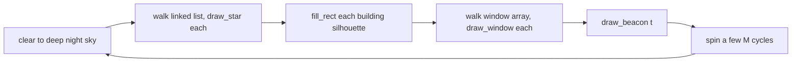

# DESIGN — riscv-skyline

How the kernel comes up, how it gets pixels onto the QEMU virt
machine's bochs-display PCI VGA, what the eight assembly drawing
primitives do, and how the test bench exercises them. Reference
material (full layouts, primitive contracts, color encoding) lives
under [`docs/`](docs/).

## Boot path

QEMU `-machine virt -bios none` loads `demo.elf` and jumps to its
entry symbol at `0x80000000`. From there:

1. **`start.s`** sets the stack pointer, installs the trap vector
   (points at `_trap_entry` in `trap.s`), and tail-jumps into
   `main`.
2. **`main()`** (`demo.c`) runs:
   - `console_init()` — UART0 console, so `kprintf` works
   - `intr_init()` — S-mode interrupt enable bits
   - `find_bochs_display()` — walks PCI bus 0 looking for vendor
     `0x1234`/device `0x1111` (the QEMU bochs card) and returns its
     ECAM config-space address
   - `vga_attach()` — wires up BAR0 (VRAM) and BAR2 (control regs),
     programs the VBE registers for 640×480×16
   - `skyline_init()` — clears the four scene globals
   - `compose_scene()` — seeds 280 stars, lays out 7 buildings with
     dense lit windows, and starts the lighthouse beacon
3. The animation loop runs forever, redrawing back-to-front every
   frame.

## PCI / bochs framebuffer wire-up

The QEMU virt machine exposes its PCIe ECAM at `0x30000000` and a
32-bit MMIO window at `0x40000000..0x80000000`. The bochs card has to
have its VRAM BAR mapped *inside* that MMIO window — putting it in
DRAM produces the silent-drop "Unexpected Bochs VBE ID" symptom that
took two debug iterations to track down.

```
[0x30000000] PCIe ECAM    -> per-device config space
[0x40000000] PCI MMIO     -> bochs-display BAR0 (VRAM, 16 MB aligned at 0x41000000)
                              bochs-display BAR2 (VBE control regs, immediately after BAR0)
[0x80000000] DRAM         -> kernel image, stack, BSS arena
```

`vga.c` runs the standard "write -1, read back to learn size" PCI BAR
probe, places BAR0 at `FBUF_PMA = 0x41000000` and BAR2 at `BAR0 +
fbsize` *bytes* (the previous version of this code did
`fbuf + fbsize` on a `uint16_t *`, advancing by 2× and missing the
control window). It then programs the bochs VBE indexes — XRES, YRES,
BPP, ENABLE — and the framebuffer is live.

## Scene composition

`compose_scene()` walks 7 buildings left-to-right, each with a
randomised top edge and width. For each building it:

- saves the silhouette rectangle into `buildings[]` so the frame loop
  can repaint the dark gray box every frame
- seeds a dense 6×8 grid of `add_window()` calls inside the building
  face, picking colors from a yellow→amber palette and skipping ~25%
  of cells so the lights look "lived in"

It then sprinkles 280 stars across the entire screen (some land
inside building footprints — they're simply occluded by the
silhouette in the redraw step) and pins a `start_beacon()` call
above the tallest building's roof.

## Frame loop

Every frame, drawn back-to-front:



`fill_rect` is the only direct framebuffer write the C side does.
`draw_star`, `draw_window`, and `draw_beacon` are all assembly in
`mp1.S` and read coordinates / colors out of the struct passed to
them.

## Drawing primitives (mp1.S)

Eight functions, all RISC-V LP64 calling convention:

- `add_star(x, y, color)` — `malloc(16)`, fill, push at head of
  `skyline_star_list`. malloc-failure → silent no-op.
- `remove_star(x, y)` — walk the list, unlink first match, `free()`.
- `draw_star(fbuf, *star)` — null-guard, screen-clip, write one
  RGB565 pixel.
- `add_window(x, y, w, h, color)` — bounds-check `skyline_win_cnt`,
  write a `struct skyline_window` into the array, increment counter.
- `remove_window(x, y)` — find by upper-left match, shift later
  entries down (windows are kept contiguous), decrement counter.
- `draw_window(fbuf, *win)` — fill an `w × h` solid rect with
  per-pixel screen clipping (the window can hang off any edge).
- `start_beacon(img, x, y, dia, period, ontime)` — populate the
  single `skyline_beacon` global.
- `draw_beacon(fbuf, t, *bcn)` — if `(t % period) < ontime`, blit
  the `dia × dia` sprite from `bcn->img` at `(bcn->x, bcn->y)`,
  again with per-pixel screen clipping.

Calling-convention details (which registers each function preserves)
are in [`docs/drawing-api.md`](docs/drawing-api.md).

## Allocator (memory.c)

Backing store is a 256 KB BSS arena, 16-byte aligned. `malloc`
rounds the request up to 16 bytes and pulls from a singly-linked
free list of 16-byte blocks if it has any; otherwise it bumps the
arena pointer. `free` always recycles into that one bucket — this is
fine because mp1.S only ever asks for 16 bytes (one
`struct skyline_star`); larger allocations from the test harness are
bump-only and are leaked on purpose. `memory_init()` resets the
arena between test cases so leaks from one case don't poison the
next.

## Test bench

`make run-test` rebuilds `test.elf` with `tests/test_main.o` swapping
in for the demo's main, and `tests/halt_replace.o` swapping in for
the panic shim so a fault returns control to the runner instead.

The runner calls each test function inside a `setjmp` / `longjmp`
trap-recovery shim (`tests/setjmp.S` + the trap path in `trap.s`),
so a faulting test gets a `FAILED` row with `cause`/`sepc`/`stval`
captured instead of crashing the kernel. A separate wrapper
(`tests/clobber.S`) detects callee-saved register clobbers — any
function that doesn't restore `s0..s11` reliably gets flagged.

The framebuffer module that the tests draw into is a software-only
mock (`tests/fb.{c,h}`); it implements the same screen-clip rules as
a real bochs display so tests can validate `draw_*` behaviour without
needing a real display device.

## Component index

| File                | Responsibility                                      |
| ------------------- | --------------------------------------------------- |
| `kernel/start.s`    | M-mode entry, stack + trap vector setup, `j main`   |
| `kernel/trap.s`     | trap save/restore, dispatch                         |
| `kernel/main` (in `demo.c`) | bring-up, PCI scan, scene seed, frame loop  |
| `kernel/vga.c`      | bochs PCI VGA driver (BAR programming + VBE)        |
| `kernel/mp1.S`      | 8 drawing primitives                                |
| `kernel/memory.c`   | malloc/free + memory_init                           |
| `kernel/console.c`  | UART0 console (kprintf path)                        |
| `kernel/serial.c`   | low-level UART register I/O                         |
| `kernel/intr.c`     | S-mode interrupt enable + handler dispatch glue     |
| `tests/`            | suite registry, runner, fault-recovery shim, fb mock |
