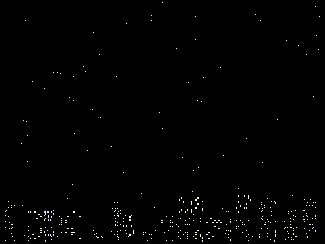

# riscv-skyline

A bare-metal RISC-V "starry-night" screen saver. Eight hand-written
RISC-V assembly drawing primitives plot stars, lit windows, and a
blinking lighthouse beacon onto a 640×480 RGB565 framebuffer that the
kernel wires up over QEMU's `bochs-display` PCI VGA card.



| What's there       | Detail                                                               |
| ------------------ | -------------------------------------------------------------------- |
| Drawing primitives | 8 functions in `kernel/mp1.S` (`add_star`, `remove_star`, `draw_star`, `add_window`, `remove_window`, `draw_window`, `start_beacon`, `draw_beacon`) |
| Framebuffer        | 16-byte aligned chunk inside the QEMU virt PCIe MMIO window; 640×480, 16 bpp RGB565 |
| Display driver     | PCI scan + bochs VBE programming in `kernel/vga.c`                   |
| Allocator          | 256 KB BSS arena + 16-byte block free list (`kernel/memory.c`)       |
| Drawing loop       | `kernel/vendor/demo.o` (starter binary, see [`NOTICE`](NOTICE)): clear → stars → lit windows → blinking beacon |
| Test bench         | 85 baseline + 10 extra cases over the 8 primitives, faulting cases recovered through a `setjmp` trap shim |

## Quick start

Tested on Ubuntu 22.04 / 24.04 with `gcc-riscv64-unknown-elf` and
QEMU 9.0+ (the bochs-display device is included in stock builds).

```sh
git clone https://github.com/Yoonkyu-Lee/riscv-skyline.git
cd riscv-skyline
sudo apt-get install -y gcc-riscv64-unknown-elf binutils-riscv64-unknown-elf \
                        qemu-system-misc python3
cd kernel
make                        # builds demo.elf
make run-demo               # boots into the screen saver (a QEMU window)
make run-test               # runs the in-kernel test bench
```

`make run-demo` opens a QEMU window backed by `-device bochs-display`
and the screen saver starts immediately. `make run-test` reboots the
kernel under a swapped entry point that runs every drawing test case
through `setjmp` / `longjmp`-based fault recovery and prints a per-case
PASS/FAIL row plus a final score line.

## Test bench

```
==========================================
Extras: 10/10 passed
Total (baseline only): 85/85
==========================================
```

The bench covers each drawing primitive end to end:
register-clobber detection (callee-saved violations), null-pointer
guards, screen-edge clipping (negative coordinates and overruns),
window list bookkeeping, beacon period/ontime arithmetic. Faulting
tests longjmp back into the suite runner instead of panicking the
kernel.

## Repository layout

```
riscv-skyline/
├── kernel/         drawing primitives, drivers, scene driver, linker script
├── tests/          test bench cases + setjmp / clobber harness + framebuffer mock
├── scripts/        setup-ubuntu.sh + screenshot helper
├── docs/           architecture, frame buffer model, drawing API
├── DESIGN.md       end-to-end walkthrough
├── LICENSE         MIT License
├── NOTICE          attribution for the one vendor binary in kernel/vendor/
└── AUTHORS         contributors
```

## Documentation

- [`DESIGN.md`](DESIGN.md) — boot path, PCI bochs probe, frame loop,
  drawing-primitive contract, allocator
- [`docs/architecture.md`](docs/architecture.md) — boot + frame loop
  diagrams (mermaid)
- [`docs/frame-buffer.md`](docs/frame-buffer.md) — 640×480 RGB565
  layout, pixel addressing, color encoding
- [`docs/drawing-api.md`](docs/drawing-api.md) — the 8 primitives:
  inputs, side effects, clipping rules, register conventions

## License

Substantively new code (drivers, drawing primitives, allocator, test
bench, docs, CI) is distributed under the [MIT License](LICENSE).
One starter binary, `kernel/vendor/demo.o` (the drawing-loop driver),
is checked in as-is — see [`NOTICE`](NOTICE) for the attribution
boundary. The contributor list is in [`AUTHORS`](AUTHORS).
