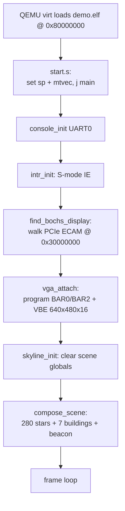
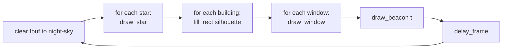
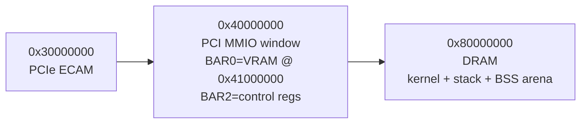
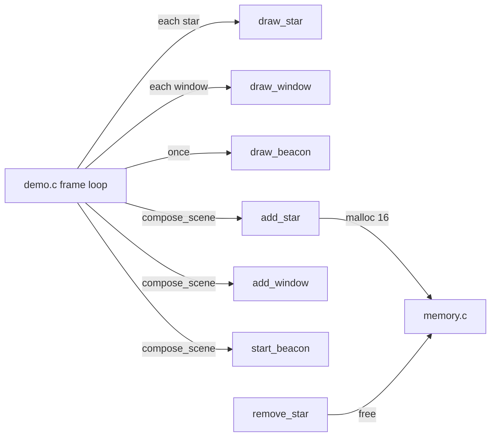

# Architecture diagrams

Cross-component diagrams. For text walk-through see
[`../DESIGN.md`](../DESIGN.md).

## Boot flow

```mermaid
flowchart TD
    QEMU[QEMU virt loads demo.elf @ 0x80000000] --> START[start.s:<br/>set sp + mtvec, j main]
    START --> CONS[console_init UART0]
    CONS --> INTR[intr_init: S-mode IE]
    INTR --> SCAN[find_bochs_display:<br/>walk PCIe ECAM @ 0x30000000]
    SCAN --> ATTACH[vga_attach:<br/>program BAR0/BAR2 + VBE 640x480x16]
    ATTACH --> INIT[skyline_init: clear scene globals]
    INIT --> SEED[compose_scene:<br/>280 stars + 7 buildings + beacon]
    SEED --> LOOP[frame loop]
```

## Frame loop

```mermaid
flowchart LR
    CLEAR[clear fbuf to night-sky] --> STARS[for each star:<br/>draw_star]
    STARS --> RECT[for each building:<br/>fill_rect silhouette]
    RECT --> WINS[for each window:<br/>draw_window]
    WINS --> BCN[draw_beacon t]
    BCN --> SPIN[delay_frame] --> CLEAR
```

## Memory map

```mermaid
flowchart LR
    ECAM[0x30000000<br/>PCIe ECAM]
    MMIO[0x40000000<br/>PCI MMIO window<br/>BAR0=VRAM @ 0x41000000<br/>BAR2=control regs]
    DRAM[0x80000000<br/>DRAM<br/>kernel + stack + BSS arena]
    ECAM --> MMIO --> DRAM
```

## Drawing primitive call graph

```mermaid
flowchart LR
    DEMO[demo.c frame loop]
    DEMO -->|"each star"| draw_star
    DEMO -->|"each window"| draw_window
    DEMO -->|"once"| draw_beacon
    DEMO -->|"compose_scene"| add_star
    DEMO -->|"compose_scene"| add_window
    DEMO -->|"compose_scene"| start_beacon

    add_star -->|malloc 16| memory_c[memory.c]
    remove_star -->|free| memory_c
```
